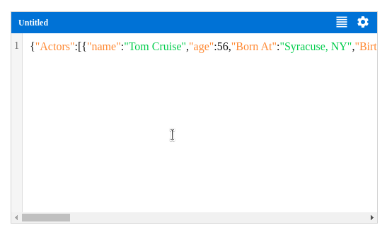

<div align="center">

# React Code Editor

⚡ by [OPEN TECH FOUNDATION](https://open-tech-foundation.pages.dev/)



</div>

> A simple code editor for React JS, useful for form `code` input.

## Features

- Simple Editor (HTML `Textarea` based)

- Syntax Highlighting

- Multiple languages & themes are supported.

- Format code with [Prettier](https://prettier.io/)

- Syntax Errors via [Prettier](https://prettier.io/) formating

- Line numbers

## Installation

Using npm

```sh
npm install @opentf/react-code-editor
```

Using Yarn

```sh
yarn add @opentf/react-code-editor
```

Using pnpm

```sh
pnpm add @opentf/react-code-editor
```

## Usage

```ts
import { Editor } from '@opentf/react-code-editor';

export default function App() {
  const code = `export default function App() {
      return <h1>Hello world</h1>
    }
  `;

  return <Editor value={code} onChange={handleChange} />;
}
```

## Props

| Name      | Type     | Required | Default      | Description                                                                                                    |
| --------- | -------- | -------- | ------------ | -------------------------------------------------------------------------------------------------------------- |
| value     | string   | Yes      | ''           | The value of the editor.                                                                                       |
| onChange  | Function | No       | undefined    | The handler function for the value change event.                                                                   |
| themes    | Theme[]  | No       | []           | You can pass aditional themes to the editor via this prop.                                                     |
| languages | Lang[]   | No       | []           | By default only limited set of languages supported, you can extend additional languages support via this prop. |
| lang      | string   | No       | 'Plain Text' | The language syntax highlighting.                                                                              |
| theme     | string   | No       | 'Light'      | The theme name to apply a theme. [See list of themes below.](#supported-thems)                                                                               |
| style     | object   | No       | {}           | The styles will be applied to the root element of the editor component.                                        |
| title     | string   | No       | 'Untitled'   | The editor title. Eg: `Config.json`                                                                            |
| config    | object   | No       | {}           | See the below table for config object.                                                                         |

### Config:

| Name       | Type   | Required | Default | Description                                          |
| ---------- | ------ | -------- | ------- | ---------------------------------------------------- |
| indent     | string | No       | 'Space' | Indent code using `"Space"` or `"Tab"`                   |
| indentSize | number | No       | 2       | The indent size.                                |
| textArea   | object | No       | {}      | Any additional props for the code editor `textarea` element. |

## Supported Languages (With formatting)

✔️ JSON

⏳ HTML

⏳ JavaScript

⏳ TypeScript

⏳ CSS

⏳ GraphQL

⏳ TOML

⏳ YAML

## Supported Languages (Without formatting)

✔️ Plain Text

⏳ Bash

⏳ Dockerfile

## Supported Thems

- Dark

- Light (Default)

**You can create your own themes easily, please refer any existing theme objects in the repo.**

## License

Copyright (c) [Thanga Ganapathy](https://github.com/Thanga-Ganapathy) ([MIT License](./LICENSE)).
